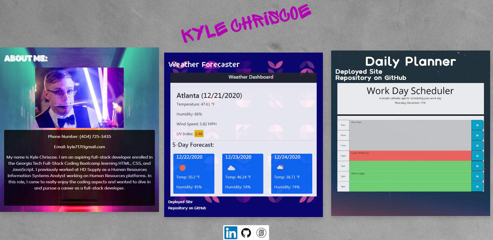

# Kyle Chriscoe - Portfolio

## Repository

This repository hosts all files load and display my personal portfolio.  It includes the HTML, CSS, and JavaScript files used on the page.

## Table of Contents
* [Portfolio](#portfolio)
* [Usage](#usage)
* [Development Roadmap](#development_roadmap)
* [Attribution](#attribution)
* [Contact](#contact)
* [License](#license)

## Portfolio

Site link: [https://udunomancer.github.io/portfolio-kyle-chriscoe/](https://udunomancer.github.io/portfolio-kyle-chriscoe/)

This Portfolio contains one page that displays information about myself and a couple of my projects.  It uses HTML for the page structure, CSS and Bootstrap to style the page, and JavaScript and jQuery for interactivity.

## Usage

* The page should display three main sections in the body
    * The two project sections should both include working links to the project repositories and project deployed site
* The page should also contain a footer that includes links to my LinkedIn and GitHub profiles, as well as a link to download my resume.
    * Clicking on the one of these three icons should bring up the links
    * Clicking the icons again should hide them

## Development Roadmap

**Initial Repository/Site Build (1/4/2021)**
* Added html file structure
* Added CSS to style page
* Built Javascript for page functionality

## Attribution
* <a href="https://www.freepik.com/photos/background">Background photo created by fwstudio - www.freepik.com</a>
* <a href="https://www.fontfabric.com">Fonts created by fontfabric - www.fontfabric.com</a>
    * Sprite Graffiti
    * Pixer
    * Panton Rust
    * Color Tube
    * Canaro
* <a href="https://www.unsplash.com">Poster images from unsplash.com</a>

## Contact
Contact me at kyle717@gmail.com

## License
[MIT License](LICENSE)
